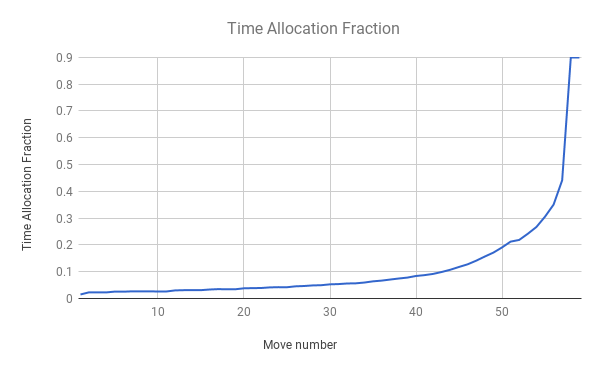

# gpu-othello
GPU-accelerated Othello AI

This Othello AI uses a parallelized GPU-based [Monte Carlo tree search](https://en.wikipedia.org/wiki/Monte_Carlo_tree_search) framework. The CPU manages the MCTS game tree and keeps track of statistics like win differential, number of simulations, and heuristics for each game state. It also launches parallelized Monte-Carlo simulations of the game states on the GPU, then updates the statistics in the game tree.

Although the GPU can perform hundreds of simulations from a given board state in parallel, its high latency meeans that the game tree will not be expanded very deeply if only the GPU were used to perform simulations. Thus, the GPU simulations are launched asynchronously; while they are being run, the CPU performs single simulations and expands the game tree further. By using rudimentary heuristics (corner occupancy, mobility, etc), this allows the GPU simulations to be launched on more promising nodes in the game tree.

Several modifications to basic MCTS were made in order to improve its performance using domain-specific knowledge. Since there is a fairly strong heuristic, the game nodes are initialized with a number of fake "simulations" using the value of the heuristic. In addition, a MCTS / minimax hybrid was used in the score backpropagation step. Instead of simply using the win percentage as the score for each node, an average of the win percentage launched from the node itself and the minimax score of its children is performed in order to calculate the score for that node. This scheme balances the game-theoretic value of minimax while also using the statistics generated from simulations launched in the non-leaf nodes of the game tree. Another modification to MCTS that was made was an end-game solver built into the game tree; this allows the algorithm to detect proven wins and losses, while still maximizing the minimum end-game score in either case.

One of the advantages of MCTS is that the algorithm can be stopped at any point and a decision can be outputted; the longer the algorithm is run, the game states are simulated and thus a better decision can be made. Thus, time allocation is an important factor in the performance of the AI; more time should be allocated to the more statistically decisive turns in the game. On the other hand, the time to make a simulation is roughly linearly decreasing as the game progresses, since fewer moves need to be made. The solution used for time allocation was to use a lookup table of time allocation fractions, i.e. the fraction of the remaining time to allocate to a given turn in the game. This time allocation fraction was calculated by taking the move number priority (a measure of the importance of a move) from [this paper](https://pdfs.semanticscholar.org/235f/b5f2ebae93e33e2bf7038bb37a690fa9390e.pdf), scaling it by a linearly decreasing function to account for the increasing speed of simulation, then dividing each move's time by the total time allocated for all subsequent moves.

## Installation
Required packages:

    cuda
    openjdk-6-jre

To build the executable, simply run `make` from the main directory.

## Usage

    ./testgame [black player] [white player] [time limit]

where `black player` and `white player` are the names of the program executables, or `Human`. Time limit is given in milliseconds.

For example, to test the AI against a built-in ply-3 minimax player using the standard 5-minute time limit:

    ./testgame gpu-othello BetterPlayer 300000

## Expected Results and Performance

Currently, `gpu-othello` performs extremely well against existing Othello AIs from the CS2 Othello competition (which this Othello framework was taken from). It can consistently beat both [130](https://github.com/onionymous/othello) and [Asimov-ml](https://github.com/Whillikers/Asimov-othello/tree/ml), two of the top student Othello AIs in the [2017 CS2 Othello competition](http://courses.cms.caltech.edu/cs2/status.html).

Running on the CPU only, the AI can perform around 200,000 simulations per second and evaluate 200,000 board states per second in the midgame (this includes the game tree updates, etc). On the other hand, running the simulations on the GPU only performs around 7.3 million simulations per second, but only evaluates 20,000 board states per second in the midgame. This is a `30x` increase in simulation throughput, but a `10x` _decrease_ in board states evaluated. This is why the hybrid CPU-GPU approach is important - this allows the CPU to continue performing rough board state evaluations with single-simulation passes, while the GPU performs large batches of simulations (current batch size is 256) at a time on the more promising nodes. Using the hybrid CPU-GPU approach, the AI can perform around 7 million simulations per second and evaluate 200,000 board states per second.

The GPU simulations are launched with one board state per block, and 256 parallel threads (i.e. simulations) per block. The relatively small threads per block is chosen because the utility of simulations diminishes rapidly - due to the central limit theorem, the utility of `n` simulations goes as `O(sqrt(n))`, so it is more important to have smaller batch sizes run on more board states, rather than larger batch sizes run on fewer board states. In order to hide the latency in the GPU simulation batches, there are a total of 8 simultaneous streams run at the same time in order to achieve maximum GPU usage (running `nvidia-smi` while `gpu-othello` is running reports GPU usage of around 97%).